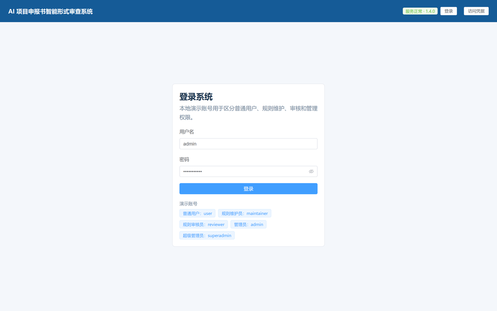
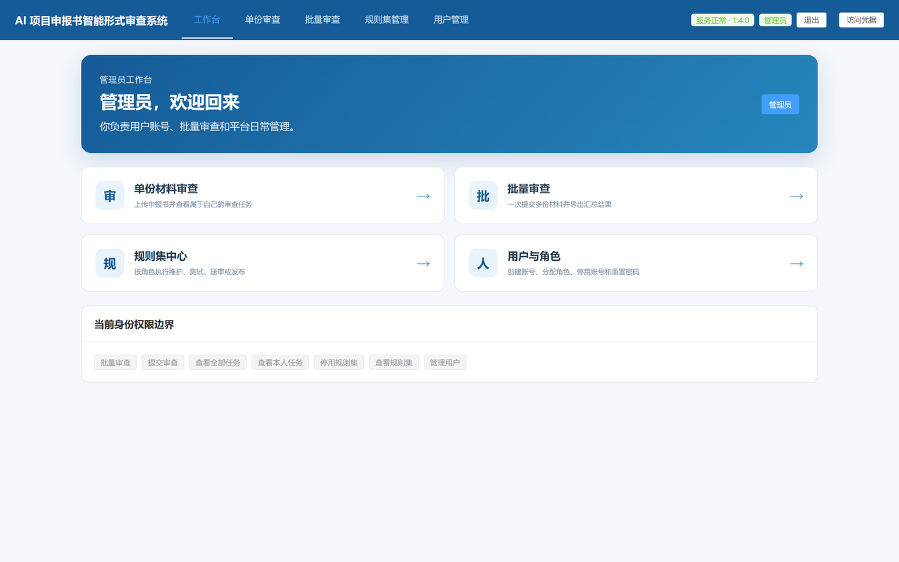
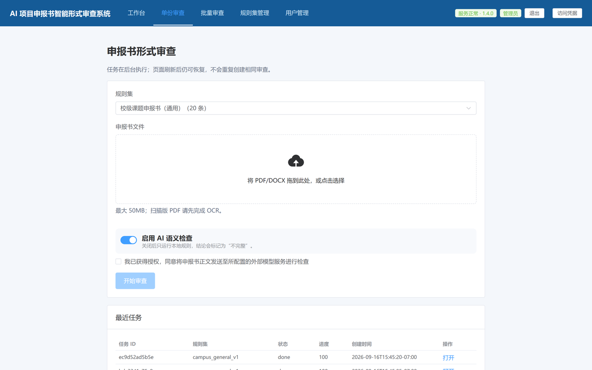
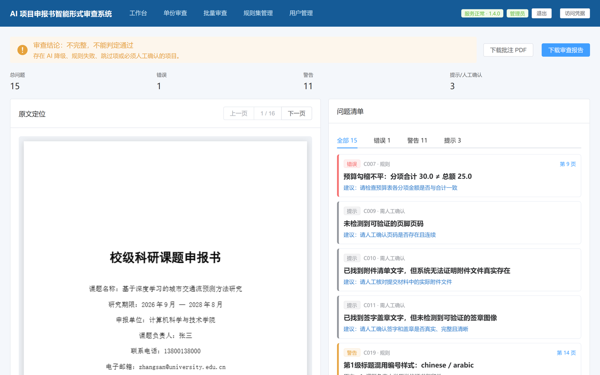
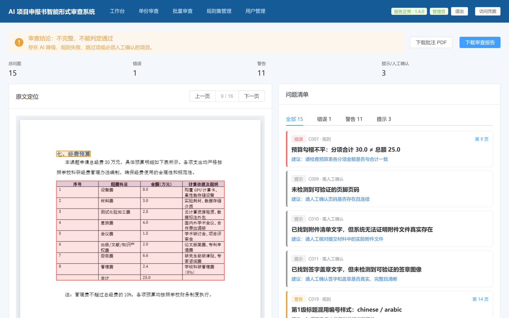
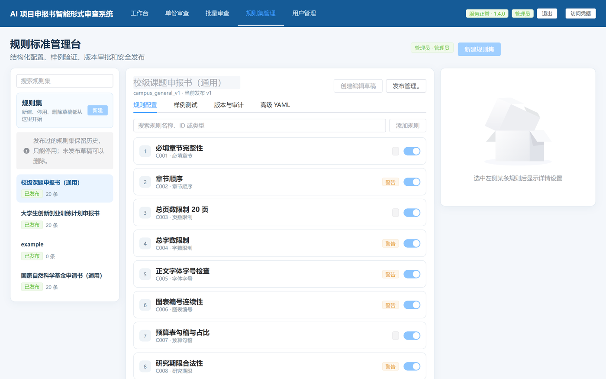
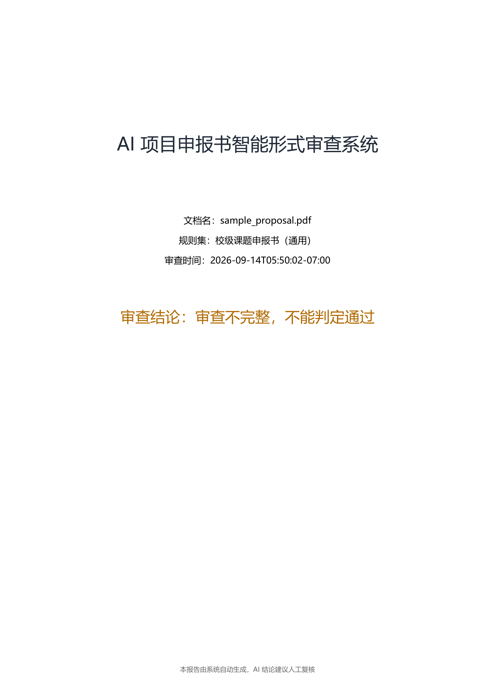
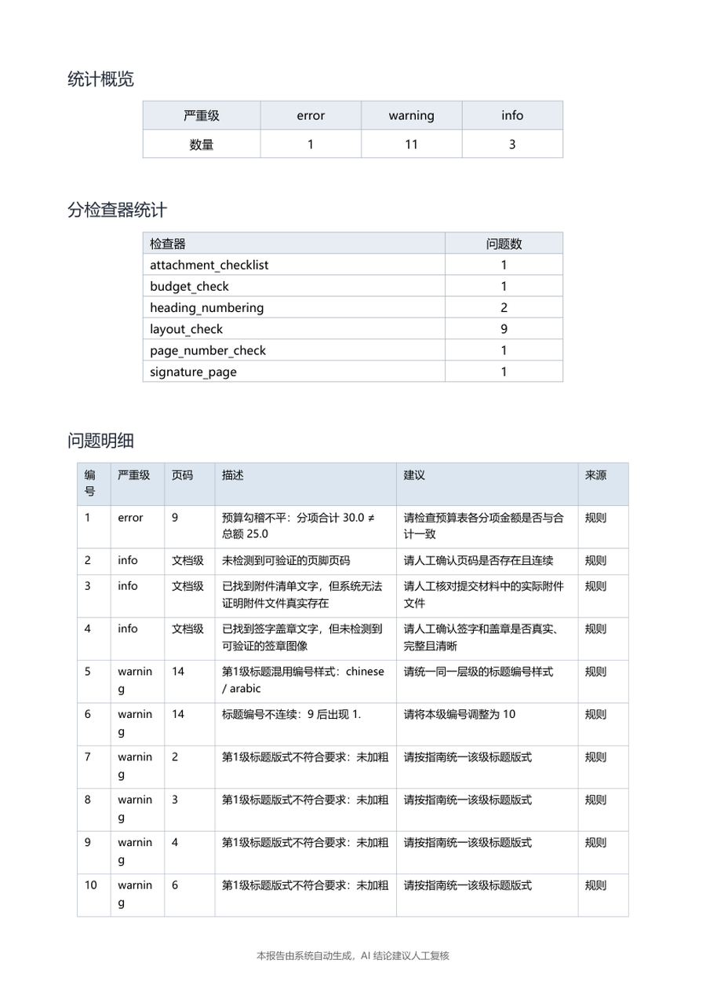
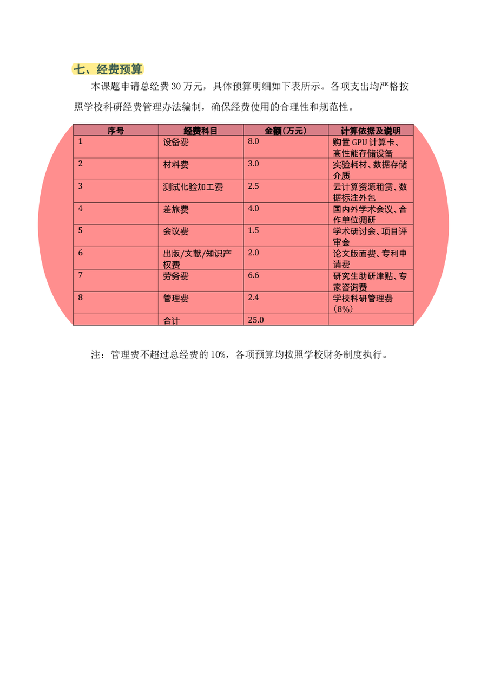

# AI 项目申报书智能形式审查系统

[](https://github.com/Iris-ricardo/ai-review/actions/workflows/ci.yml)
[](LICENSE)
[](backend/requirements.txt)

面向高校项目申报书的本地 Web 形式审查工具：PDF/DOCX 上传、确定性规则、可配置必填字段与字段格式、跨字段一致性、标题编号、页面版式、可选语义检查、原文定位、批注 PDF、审查报告和批量汇总。

当前版本 `1.4.0`，构建标识 `20260721-strict-approval`。

**文档（共 3 份）**

| 文档 | 内容 |
|---|---|
| 本 README | 启动、使用、配置、安全、开发测试、部署迁移、排错 |
| [规则与权限.md](规则与权限.md) | 检查器覆盖矩阵与新增路线、本地用户角色与权限边界 |
| [eval/README.md](eval/README.md) | 评测工具、合成样本池、指标口径与复现命令 |

---

## 项目简介

高校和科研院所的申报书在送专家评审之前，要先过一遍**形式审查**：必填字段有没有漏、预算数字前后对不对得上、标题编号有没有跳号、篇幅页数有没有超、扫描件是不是缺页。这类检查量大、重复，纯靠人眼容易漏。

本项目把它做成一个**本地部署的 Web 工具**：上传 PDF / DOCX → 规则引擎逐条检查 → 输出定位到原文的审查报告、可直接发给作者的批注 PDF、以及批量汇总表。

- **规则**：20 类检查器，3 套规则集共 60 条规则（校级 / 大创 / 国自然），规则集用 YAML 描述，可在界面里增删改并回归验证
- **确定性优先**：默认全程离线；只有显式打开外发开关，并且对具体任务单独确认之后，才把必要片段交给大模型做语义检查
- **结论诚实**：AI 不可用、检查降级或存在必须人工确认的项时，结论返回 `incomplete`，不会给"通过"
- **工程**：后端 485 项 pytest（样本池未生成时 481 passed / 4 skipped）、前端 27 项 vitest + 8 项 node 测试，每次推送都在 CI 上跑
- **部署**：单实例单进程，Windows 一键脚本或 Docker Compose 两种方式，不需要 Redis / Celery / PostgreSQL

## 界面预览

| 登录（部署级访问凭据 + 账号） | 仪表盘：任务概览与快捷入口 |
|---|---|
|  |  |

| 发起审查：选规则集 + 上传材料 | 结果页：结论、命中统计与问题列表 |
|---|---|
|  |  |

| 结果页：点开命中看原文定位 | 规则集管理：20 类检查器逐个开关 |
|---|---|
|  |  |

用户与角色管理（RBAC）、批量审查与批量汇总导出另有截图：`docs/screenshots/ui-07-users.png`、`docs/screenshots/ui-08-batch.png`。

## 产出样例

审查报告与批注 PDF 都由程序自己生成（reportlab 嵌入中文 TrueType 字体；批注用 PDF 原生高亮标注，在 PDF 阅读器里悬停即可看到批注内容）：

| 审查报告第 1 页：结论 | 第 2 页：逐条证据与原文定位 | 批注 PDF：预算勾稽错误高亮 |
|---|---|---|
|  |  |  |

批量汇总 XLSX、合成样本池与三口径评测报告等其余产出物，见 [`eval/README.md`](eval/README.md)。

---

## 快速开始

双击项目根目录的 `一键启动项目.bat`。脚本会：

1. 检查项目 Python 虚拟环境和 Node 环境；
2. 源码更新后自动重新构建前端；
3. 启动单实例 FastAPI 服务（`launch_project.ps1`）；
4. 打开 `http://127.0.0.1:8000`。

一键模式只启动一个 Python 服务，前端生产文件由 FastAPI 同源托管，不需要 Redis、Celery、PostgreSQL 或单独的 5173 端口。

首次打开若提示输入**访问凭据**，请从本机 `backend\.env` 复制 `ACCESS_TOKEN` 粘贴；不要在聊天、截图或日志中暴露该值。

停止服务：

```powershell
.\stop_project.ps1     # 或双击 停止项目.bat
```

脚本只会终止 PID 记录中、且可执行文件位于当前项目目录的进程，不会按端口盲目结束其他程序。

也可直接调用启动脚本（例如不自动开浏览器，适合脚本化启动）：

```powershell
.\launch_project.ps1
.\launch_project.ps1 -NoBrowser
```

健康检查与日志：

```text
http://127.0.0.1:8000/api/health      # status=ok 表示数据库、规则集与存储可用
backend/server.runtime.log            # 5MB 滚动，保留 3 份
```

`checks` 还会显示 LibreOffice、OCR、LLM 配置、访问控制、活动任务数和队列容量。LibreOffice/OCR 不可用不会把数字文本 PDF 误报成服务宕机，但会影响 DOCX 或扫描件能力；缺少 LibreOffice 时，DOCX 材料的下载与审查会返回 **503 并附安装指引**（`choco install libreoffice-fresh`，或用 `SOFFICE_PATH` 指定 `soffice`），不会用笼统的 500 掩盖环境问题。任务页显示阶段、当前规则和每条规则的耗时/状态；长时间无心跳可主动取消，后台看门狗也会把失去活动的任务标记为 `timed_out`。

另外三个字段用于确认“8000 端口上跑的是不是当前这份源码”：`build_id`、`instance_fingerprint`（项目路径指纹）、`source_fingerprint`（后端源码指纹）——启动脚本正是靠它们判断能否复用已在运行的进程；改了后端代码却没重启时，这里会与磁盘源码不一致。`report_font_available` 表示报告所需的中文字体能否注册成功。

### 手动开发模式

```powershell
.\scripts\start_backend.ps1     # 终端一：后端
.\scripts\start_frontend.ps1    # 终端二：前端热更新（http://127.0.0.1:5173，API 代理到 8000）
```

## 使用流程

1. 在“上传审查”页选择规则集和 PDF/DOCX。
2. **可选**是否启用 AI 语义检查：不勾选就只跑 17 类本地规则（更快、不产生费用、材料不出本机）；要勾选需先满足 [AI 语义检查（可选）](#ai-语义检查可选)一节的三道闸门，并确认已获得材料外发授权。
3. 提交后查看当前阶段、当前规则、每条规则状态和最后活动时间。
4. 页面刷新后会恢复活动任务；最近任务也可重新打开。
5. 任务结束后进入结果页，查看原文定位、高亮问题、批注 PDF 和审查报告。

任务可取消，且受规则级、模型请求级和任务总截止时间约束。相同文件、规则快照和 AI 模式的活动任务会自动复用，不会重复计费。

### 页面一览

| 页面 | 路径 | 所需能力点 | 用途 |
|---|---|---|---|
| 仪表盘 | `/dashboard` | `dashboard.view` | 任务概况与最近活动 |
| 上传审查 | `/review` | `review.create` | 上传、选规则集、可选 AI、进度轮询与任务恢复 |
| 结果 | `/result/:taskId` | `review.view_own` | 原文定位、高亮问题、批注 PDF 与报告 |
| 规则集管理 | `/rules` | `ruleset.view` | 草稿编辑、校验、样例测试、四眼审批 |
| 用户管理 | `/users` | `users.manage` | 建号、改角色、重置密码、停用 |
| 批量审查 | `/batch` | `review.batch` | 多文件提交、进度总览与汇总导出 |

未登录或会话失效会跳回 `/login`；处于强制改密状态时会带 `mustChange=1` 回到登录页改密。

### 批量审查

一次选多个 PDF/DOCX 提交，系统按队列逐个执行；批量页显示每份的状态，完成后可导出汇总表（`GET /api/v1/batches/{batch_id}/summary.xlsx`）。批量入口在 `use_ai=true` 时同样要求材料外发授权，与单份提交一致；批量里的每个任务都会单独落库授权记录。

## 管理审查规则

1. 使用具备规则维护权限的账号登录，打开顶部“规则集管理”；已发布版本默认只读。
2. 从已发布版本创建编辑草稿，保存并校验当前内容。
3. 在“样例测试”中填写已上传文档的 ID；若运行 AI 规则，必须确认材料外发授权。
4. 当前内容通过样例测试后，提交时必须指定另一名有效审核员。
5. 只有指定审核员可审核并发布；创建人或提交人不能审核、驳回或发布自己的版本，超级管理员也不能绕过该四眼约束。
6. 新任务使用新发布版本，历史任务保留原规则快照；恢复历史版本只会创建新草稿，仍需重新测试、审核和发布。

### 从指南文件自动生成规则集

`POST /api/v1/rulesets/from-guideline`（需管理凭据）允许上传一份申报指南（PDF/DOCX），由模型抽取章节、字段、页数、字数、预算比例等要求，生成规则集草稿供人工复核后再发布。**这条路径会调用外部模型**，因此同时受 [AI 语义检查（可选）](#ai-语义检查可选)的三道闸门约束（部署开关、`LLM_API_KEY`、入口处的授权确认）；生成结果只是草稿，仍要经过校验、样例测试与四眼审批才能生效。

已实现本地账号、五角色 RBAC、按能力点控制的前后端入口、普通用户任务归属隔离、用户管理和严格四眼审批。`Authorization: Bearer` 用于用户会话——登录签发服务端会话（`user_sessions` 表），退出/退出全部设备、改密、停用或降权都会立即撤销会话，旧 token 即刻失效且重启不丢失撤销状态；`X-Access-Token` 用于外围访问控制。旧版管理接口（保存规则集、指南生成、数据清理、模型连通检查）要求超级管理员会话；配置 `ADMIN_TOKEN` 后也接受 `X-Admin-Token` 作为兼容管理凭据，但 `ADMIN_TOKEN` 为空时不再放行任何管理请求。规则与权限边界详见 [规则与权限.md](规则与权限.md)。

### 修改规则集：两种方式

**方式一：界面/接口（推荐）**

规则集管理 → 新建草稿（从当前已发布版本克隆）→ 编辑（表单或直接改 YAML）→ 校验 → 样例试跑 → 提交审核 → 由**另一名**审核员通过 → 发布。发布后新任务使用新快照，历史任务保留原快照；回滚历史版本只会生成新草稿，仍需重新测试、审核、发布。

接口前缀 `/api/v1/rule-admin`（需对应能力点）：`/checkers`（检查器目录与参数 schema）、`/validate`（校验）、`/versions/{id}/yaml`（改草稿 YAML）、`/versions/{id}/rules/toggle|copy|reorder`、`/versions/{id}/test`（样例试跑）、`/versions/{id}/submit` → `/approve` → `/publish`、`/rulesets/{id}/restore`（回滚）。

**方式二：直接改 `rules/*.yaml`（适合本机开发、批量调整）**

- 文件：`rules/campus.yaml`（`campus_general_v1`）、`rules/dachuang.yaml`（`dachuang_2026_v1`）、`rules/nsfc.yaml`（`nsfc_general_v1`），每套 20 条 = 17 条确定性 + 3 条 AI。
- 规则字段：`id`（唯一，字母开头、2–32 位字母数字或 `_`/`-`，如 `C001`）、`type`（检查器类型，共 20 种，见 [规则与权限.md](规则与权限.md)）、`severity`（`error`/`warning`/`info`，默认 `error`）、`description`、`params`（按该检查器的参数 schema）、`enabled`（默认 `true`）、`basis`/`tags`/`review_note`（依据出处与备注，只入快照、不参与判定）。
- **优先级陷阱（务必先看这条）**：三个内置规则集在首次打开“规则集管理”时已被导入为**受管规则集**，审查只读数据库里的**已发布快照**；此后**直接改 YAML 文件不会影响审查结果**。要让文件改动生效：①走方式一在界面里发布；或 ②用 `DELETE /api/v1/rule-admin/rulesets/{id}`（需 `ruleset.delete` 能力）删除受管记录，回落到“直接读文件”模式——代价是丢失该规则集的版本历史与审批记录。新增的、**尚未被受管**的 YAML 文件不受此限制，改完即按文件生效（无需重启）。
- 校验：界面“校验”，或 `POST /api/v1/rule-admin/validate`（需 `ruleset.edit` 能力）。校验会拦下规则 ID 重复、未知检查器、必填参数缺失，并对“会调用外部 AI”的规则给出告警。

### 改完怎么验证（闭环）

```powershell
# 1) 只生成受影响的命中样本（不必整池重跑）
.\.venv\Scripts\python.exe eval\corpus\generate_samples.py --ruleset campus --include font_check_hit
# 2) 上传该样本审查（或界面里的“样例测试”），核对命中规则与条数是否符合预期
# 3) 全量回归：样本池三层自检 + 端到端评测（三口径报告）
.\.venv\Scripts\python.exe eval\corpus\generate_samples.py --ruleset all
.\.venv\Scripts\python.exe eval\run_eval.py
```

## 结论含义

| 结论 | 含义 |
|---|---|
| `pass` | 所有自动检查完整执行，未发现 error，且不存在必须人工确认项 |
| `needs_revision` | 检查完整执行，但发现 error |
| `incomplete` | AI 被关闭/降级、规则失败或存在签章/附件等人工确认项，不能判定通过 |

系统不会把模型失败、规则崩溃或人工确认项伪装成“通过”。形式审查结果不替代正式专家评审。

## AI 语义检查（可选）

**17 类确定性检查始终可用，不需要联网、不需要密钥**；AI 语义检查只是可选增强，用来判断确定性规则覆盖不到的语义问题（是否匿名、标题与内容是否明显不符、期限/经费/人员的语义矛盾）。

- **哪些规则用 AI**：每套规则集 20 条里有 3 条（校级为 `C013/C014/C015`，大创 `D013–D015`，国自然 `N013–N015`）；另有 `reference_format` 在参数 `semantic_review: true` 时才走 AI 复核。
- **三道闸门，缺一不会外发**：①部署开关 `AI_EGRESS_ENABLED=true`；②提交任务时勾选“已获材料外发授权”（按任务落库审计）；③`LLM_BASE_URL`/`LLM_API_KEY`/`LLM_MODEL` 配置正确。
- **关闭 AI 时的行为**：确定性规则照常执行，3 条 AI 规则被标记为*跳过*并留下“AI 检查未执行”的降级项，结论为 `incomplete`——检查不完整时系统不会给“通过”。
- **授权与留痕**：授权记录与任务绑定，批量、规则试跑、重启恢复同样受约束；材料外发的唯一出口会再校验一次部署开关与任务授权。
- **联通性与限额**：`POST /api/v1/system/llm-check`（需 `X-Admin-Token`，只发硬编码提示词、不含任何材料）用于验证端点；单任务模型请求上限 `LLM_MAX_CALLS_PER_TASK=8`、并发 `LLM_MAX_CONCURRENCY=1`、单请求 `LLM_TIMEOUT=60` 秒、单规则 `RULE_TIMEOUT_SECONDS=180` 秒。
- **别被健康检查误导**：`/api/health` 的 `llm_configured` 只表示 `LLM_API_KEY` 非空，占位符也算“已配置”，不能当作 AI 可用性证据。

## 核心架构

```text
浏览器（Vue 3 + PDF.js）
        │ 同源 HTTP
FastAPI 单实例
        ├─ 流式上传与文件签名校验
        ├─ SQLite/WAL 持久化任务与规则快照
        ├─ 有界任务队列、取消、总超时、心跳看门狗
        ├─ LibreOffice DOCX→PDF / PyMuPDF / 可选 OCR
        ├─ 本地确定性规则
        ├─ 有界 Kimi/OpenAI-compatible JSON 调用
        └─ 批注 PDF、审查报告、批量 XLSX
```

SQLite 与进程内有界执行器组成一个诚实的单实例部署。不要使用多个 Uvicorn worker；多实例扩展需要把执行队列迁移到真正的外部任务系统。

## 接口速查

| 类别 | 方法与路径 | 鉴权 |
|---|---|---|
| 健康检查 | `GET /api/health`（别名 `GET /health`） | 无 |
| 登录与会话 | `POST /api/v1/auth/login`、`/logout`、`/logout-all`、`/change-password`、`GET /me` | 登录本身免会话，其余需 Bearer |
| 用户与角色 | `GET /api/v1/auth/users`、`/roles`、`/reviewers`；`POST /users`、`POST /users/{id}/reset-password` | Bearer + 对应能力点 |
| 文档 | `POST /api/v1/documents`（上传）、`GET /documents`、`GET /documents/{id}`、`GET /documents/{id}/file` | Bearer |
| 审查 | `POST /api/v1/reviews`、`GET /reviews`、`GET /reviews/{id}`、`POST /reviews/{id}/cancel`、`GET /reviews/{id}/issues` | Bearer |
| 产物下载 | `GET /api/v1/reviews/{id}/report.pdf`、`GET /api/v1/reviews/{id}/annotated.pdf`、`GET /api/v1/batches/{id}/summary.xlsx` | Bearer |
| 批量 | `POST /api/v1/batches`、`GET /api/v1/batches/{id}` | Bearer |
| 规则集 | `GET /api/v1/rulesets`、`GET /rulesets/{id}`；`PUT /rulesets/{id}`、`POST /rulesets/from-guideline` | 读取免管理凭据，写入需管理 |
| 规则管理 | `/api/v1/rule-admin/...`（见「修改规则集：两种方式」） | Bearer + 能力点 |
| 运维 | `POST /api/v1/maintenance/cleanup`、`POST /api/v1/system/llm-check` | 管理凭据 |

三点鉴权约定：

- **部署级**：只要设置了 `ACCESS_TOKEN`，**所有** `/api/v1` 请求都要带 `X-Access-Token`（连登录接口也不例外）；留空则只依赖用户会话。前端把该值存在浏览器 sessionStorage，不用 Cookie。
- **用户级**：`Authorization: Bearer <token>`，登录时签发服务端会话，可即时撤销。
- **兼容管理凭据**：`X-Admin-Token: <ADMIN_TOKEN>`，仅用于少数管理接口；`ADMIN_TOKEN` 为空时管理接口一律拒绝，处于强制改密状态的账号也会被管理守卫拒绝。

## 配置

本机配置文件为 `backend\.env`，模板 `.env.example`；Docker 用项目根目录 `.env`，模板 `.env.docker.example`。真实密钥文件已被 `.gitignore` 排除。

| 配置项 | 默认 | 说明 |
|---|---:|---|
| `LLM_BASE_URL` | Moonshot API | OpenAI-compatible 接口根地址 |
| `LLM_API_KEY` | 空 | Kimi/API 密钥 |
| `LLM_MODEL` | `kimi-k3` | 模型名 |
| `LLM_TIMEOUT` | 60 秒 | 单次模型请求上限 |
| `LLM_MAX_RETRIES` | 1 | SDK 重试关闭后，由项目执行的额外重试次数 |
| `LLM_MAX_CALLS_PER_TASK` | 8 | 单任务模型请求预算 |
| `TASK_TIMEOUT_SECONDS` | 900 秒 | 单任务总期限 |
| `RULE_TIMEOUT_SECONDS` | 180 秒 | 单规则总期限 |
| `TASK_MAX_WORKERS` | 2 | 审查工作线程数 |
| `TASK_QUEUE_CAPACITY` | 64 | 等待队列上限 |
| `AUTH_REQUIRED` | `true` | 是否要求登录用户会话 |
| `AUTH_CREATE_DEMO_USERS` | `false` | 空库是否创建固定密码演示账号（生产默认关闭） |
| `AUTH_FORCE_DEMO_PASSWORD_CHANGE` | `true` | 演示账号与初始超管首次登录强制改密 |
| `AUTH_BOOTSTRAP_ADMIN_USERNAME` | `admin` | `AUTH_CREATE_DEMO_USERS=false` 时空库首启创建的初始超管用户名 |
| `AUTH_BOOTSTRAP_ADMIN_PASSWORD` | 空（首次部署必须先设置） | 初始超管密码；留空且未开演示账号时空库不会创建任何账号，无人能登录 |
| `AI_EGRESS_ENABLED` | `false` | 部署级 AI 外发总开关；`false` = 全局禁止材料正文外发（优先于前端勾选与 `LLM_API_KEY`）。AI 检查整体可选，见 [AI 语义检查（可选）](#ai-语义检查可选) |
| `REPORT_FONT_PATH` | 空（按平台候选查找） | 报告 PDF 中文字体路径；Docker 内由 compose 注入镜像内已固化并验证过的字体 |
| `MAX_UPLOAD_SIZE_MB` | 50 | 单个上传文件大小上限（MB） |
| `TESSDATA_PREFIX` | 空（自动探测） | Tesseract 语言目录；留空由 PyMuPDF 调 `tesseract --list-langs` 自动探测 |
| `AUTH_SECRET` | 首次安装随机生成 | 用户会话签名密钥 |
| `ACCESS_TOKEN` | 首次安装随机生成 | 设置后保护全部 `/api/v1` 接口 |
| `ADMIN_TOKEN` | 首次安装随机生成 | 兼容管理、模型预检和数据清理凭据 |
| `DATA_RETENTION_DAYS` | 30 | 清理候选保留天数 |

`setup_windows.ps1` 只在值为空或仍为模板占位符时生成新的 `ACCESS_TOKEN`、`ADMIN_TOKEN`、`AUTH_SECRET`，不覆盖真实已有值；它还会补齐缺失的安全配置键（`AUTH_*`、`AI_EGRESS_ENABLED` 等），并在未开启演示账号时生成随机初始超管密码写入 `backend\.env`（脚本不回显密码，需自行打开文件读取）。网络部署必须使用独立随机值并更换演示账号密码。前端凭据只保存在当前浏览器会话中。

### 演示 / 比赛演示环境

模板默认取生产安全值（不建演示账号、首登强制改密、AI 外发关闭）。本机离线或比赛演示要开箱可用，需**显式**修改并承担代价：

| 键 | 演示值 | 代价 |
|---|---|---|
| `AUTH_CREATE_DEMO_USERS` | `true` | 创建 5 个固定密码账号，口令可由源码与文档推导，仅限本机离线演示 |
| `AUTH_FORCE_DEMO_PASSWORD_CHANGE` | `false` | 免去首登改密，演示口令长期有效 |
| `AI_EGRESS_ENABLED` | `true` | 允许材料正文外发到 LLM；开启前必须确认材料已获外发授权，且 `LLM_BASE_URL`/`LLM_API_KEY` 指向合规端点 |

演示结束请改回生产安全默认值，避免安全默认值被长期绕过。

## 隐私与安全

- 未勾选授权时，后端拒绝把正文发送给外部模型。
- 部署级总开关 `AI_EGRESS_ENABLED` 默认 `false`：即使前端勾选、`LLM_API_KEY` 已配置，后端也在统一出口拒绝外发。
- 默认不创建源码可推导密码的演示账号，初始超管首次登录强制改密。
- 关闭 AI 后只运行本地规则，最终结论为 `incomplete`。
- 文件分块读取、限制大小，并验证 PDF/DOCX 真实签名与 DOCX 解压体积/压缩比。
- 模型输入有字符上限、调用预算、并发限制、结构化 JSON 和证据原文校验。
- 文档内容被标记为不可信数据，提示词中的文档指令不得改变系统行为。
- API 不返回服务器内部文件路径；Docker 进程以非 root 用户运行。

已在对话或日志中暴露过的密钥应立即在模型服务控制台轮换，不能只从 `.env` 删除。

## OCR 与人工确认

系统会在页面几乎没有数字文本且包含图像时尝试 OCR。Docker 镜像内置中英文 Tesseract；Windows 本机若没有可用语言包，会保留数字文本路径，并在整份文档文字不足时明确提示先做 OCR。

签字、盖章和附件真实性无法仅靠文字关键词可靠证明，因此即使找到相关字样也会产生“需人工确认”，不会自动通过。

## 开发与测试

环境与依赖：

| 依赖 | 版本 / 位置 | 用途 |
|---|---|---|
| Python | 3.11+（本项目开发机为 3.13） | 后端运行与测试 |
| Node.js | 项目自带 `.tools\node`（24.18.0） | 仅构建/测试前端时需要 |
| LibreOffice | 项目自带 `.tools\LibreOffice`（便携版） | DOCX→PDF 转换，缺省自动探测 |
| Tesseract | 可选，未随项目提供 | 扫描件 OCR；缺失时系统会明确提示先做 OCR |
| 磁盘 | 约 2 GB（含 `.tools`、`.venv`、`node_modules`） | 复制/打包时留意 |

后端（全量测试：485 项全部通过；样本池未生成时会显示 `481 passed, 4 skipped`）：

```powershell
cd backend
..\.venv\Scripts\python.exe -m pip install -r requirements-dev.txt
..\.venv\Scripts\python.exe -m pytest -q
# 只跑某个文件/某个用例
..\.venv\Scripts\python.exe -m pytest tests/test_parse_cache_config.py -q
```

前端（组件级测试 27 项 + 既有 8 项；构建产物由后端同源托管）：

```powershell
cd frontend
$env:Path = "$((Resolve-Path ..\.tools\node).Path);$env:Path"
npm.cmd install          # 首次或依赖变更后
npm.cmd test             # vitest（jsdom 组件测试）
npm.cmd run test:node    # node --test（既有 api 测试）
npm.cmd run build        # 重建 dist（修改前端源码后必须执行）
npm.cmd run test:watch   # 组件测试监视模式
```

评测与样本池（默认禁用真实模型，避免费用）：

```powershell
.\.venv\Scripts\python.exe eval\run_eval.py                          # 20 样本端到端评测（三种口径报告）
.\.venv\Scripts\python.exe eval\corpus\generate_samples.py --ruleset all   # 生成 54 份合成样本 + 分层自检
.\.venv\Scripts\python.exe eval\smoke_llm.py                         # 真实模型冒烟（仅合成样本，产生费用）
```

只有显式设置 `EVAL_USE_LLM=true` 才会在批量评测中调用真实模型。指标口径、样本清单与自检说明见 [eval/README.md](eval/README.md)。

## 部署与迁移

### 打包给其他电脑

```powershell
powershell -ExecutionPolicy Bypass -File .\package_project.ps1 -IncludeRuntime
```

产物在 `release\`（可用 `-OutputDir <目录>` 改位置）。`-IncludeRuntime` 会把随项目打包的 Node.js 与 LibreOffice 一起带上，队友电脑更易直接运行。默认**不**打包：`backend\.env`（密钥）、`backend\review.db*`（本机数据）、`backend\uploads\`、`backend\outputs\`、`.venv\`、`frontend\node_modules\`、缓存与日志。

确需连本机演示数据一起迁移时才用 `-IncludeRuntime -IncludeData`，并先确认包内没有敏感申报书、密钥或隐私材料。**不要**直接复制整个项目文件夹（会混入虚拟环境、缓存、日志、本机数据库、上传材料和真实 API 密钥）。

### 目标电脑准备

- Windows 10/11；Python 3.11+；能访问 Python 包源（首次装依赖用）。
- 使用 `-IncludeRuntime` 时通常无需另装 Node.js / LibreOffice；否则改前端需装 Node.js，DOCX→PDF 需装 LibreOffice 并配置 `SOFFICE_PATH`。

### 首次运行

```powershell
powershell -ExecutionPolicy Bypass -File .\setup_windows.ps1
```

脚本会：创建 `.venv` 并安装后端依赖 → 从 `.env.example` 生成 `backend\.env`（若不存在）→ 随机生成 `ACCESS_TOKEN`/`ADMIN_TOKEN`/`AUTH_SECRET` → 补齐缺失的安全配置键（不覆盖已有值）→ 未开演示账号时生成随机初始超管密码写入 `backend\.env` → 若包内有 LibreOffice 则自动写入 `SOFFICE_PATH` → 有 Node.js 时安装前端依赖并构建。

随后按需编辑 `backend\.env`：要用 AI 语义审核，填真实 `LLM_API_KEY` 并把 `AI_EGRESS_ENABLED` 改为 `true`；只演示本地规则则保持 `false` 且不必填密钥。然后双击 `一键启动项目.bat`，浏览器打开 `http://127.0.0.1:8000`。

已经带了 `frontend\dist` 且目标机不需要重新构建前端时，可加 `-SkipFrontend` 跳过前端依赖安装与构建：

```powershell
powershell -ExecutionPolicy Bypass -File .\setup_windows.ps1 -SkipFrontend
```

### 登录账号

默认生产安全：空库首启**不创建**演示账号，而是用 `AUTH_BOOTSTRAP_ADMIN_PASSWORD` 创建唯一超管。

| 身份 | 用户名 | 密码 |
|---|---|---|
| 超级管理员 | `AUTH_BOOTSTRAP_ADMIN_USERNAME`（默认 `admin`） | `AUTH_BOOTSTRAP_ADMIN_PASSWORD`（`setup_windows.ps1` 已随机生成，首次登录强制改密） |

仅当显式写入 `AUTH_CREATE_DEMO_USERS=true` **且**数据库为空时，首启才初始化固定密码演示账号：

| 身份 | 用户名 | 密码 |
|---|---|---|
| 普通用户 | `user` | `user123456` |
| 规则维护员 | `maintainer` | `maintainer123456` |
| 规则审核员 | `reviewer` | `reviewer123456` |
| 管理员 | `admin` | `admin123456` |
| 超级管理员 | `superadmin` | `superadmin123456` |

演示口令可由源码和文档推导，只适合本机离线演示；联网或对外演示前必须改回 `AUTH_CREATE_DEMO_USERS=false` 并修改全部默认密码。

### Docker

Compose 使用项目根目录的 `.env`（**不读** `backend\.env`）：

```powershell
Copy-Item .env.docker.example .env
# 编辑 .env：至少填 ACCESS_TOKEN / ADMIN_TOKEN / AUTH_SECRET / AUTH_BOOTSTRAP_ADMIN_PASSWORD
docker compose up --build -d
```

也可不建 `.env`，直接用 shell 环境变量（优先级更高）：`$env:ACCESS_TOKEN=...` 等。要点：

- 三个凭据（`ACCESS_TOKEN`、`ADMIN_TOKEN`、`AUTH_SECRET`）必填，缺失时 compose 拒绝启动。
- 安全配置全部可从宿主透传，默认生产安全：`AUTH_REQUIRED=true`、`AUTH_CREATE_DEMO_USERS=false`、`AUTH_FORCE_DEMO_PASSWORD_CHANGE=true`、`AI_EGRESS_ENABLED=false`。
- `.env` 内路径必须是容器内绝对路径（`sqlite:////data/review.db`、`/data/uploads`、`/data/outputs`、`/app/rules`、`/usr/bin/soffice`）。**不要**把 `.env.example` 复制成根目录 `.env`：`./uploads`、`../rules` 是相对路径，会让数据落到容器可写层而非数据卷。
- `REPORT_FONT_PATH` 默认 `/usr/local/share/fonts/review/review-cjk.ttc`：Dockerfile 从 `fonts-wqy-microhei` 复制（0644，非 root 可读），并在构建期以 `appuser` 身份用 reportlab 真实注册。reportlab 不支持 CFF/PostScript 轮廓，故不能用 `fonts-noto-cjk` 的 `.ttc`（它只供 LibreOffice 渲染中文 DOCX）。
- 服务地址 `http://127.0.0.1:8000`，SQLite/上传/输出保存在 `review-data` 卷；Compose 只启动一个实例，这是当前架构的正确部署方式。

### 迁移常见问题

| 现象 | 处理 |
|---|---|
| 提示找不到 Python 3.11+ | 安装 Python 3.11+，勾选加入 PATH，或安装 Python Launcher |
| `pip install` 失败 | 检查网络，或切换可访问的 pip 镜像源后重跑 `setup_windows.ps1` |
| 勾选 AI 后失败 | 检查 `LLM_BASE_URL`/`LLM_API_KEY`/`LLM_MODEL`、密钥额度与网络；确认 `AI_EGRESS_ENABLED=true` |
| DOCX 上传后转换失败 | 确认 `SOFFICE_PATH` 指向有效 `soffice.exe`；带 `.tools/LibreOffice` 的包首启会自动配置。接口返回 503「服务端未安装 LibreOffice」时按提示安装即可，PDF 材料不受影响 |
| 提示 `Port 8000 is occupied` | 关闭占用程序，或先执行 `.\stop_project.ps1` |

## 排错

- **端口 8000 被占用**：一键脚本只会替换本项目虚拟环境中的旧进程，且要求其无活动任务；无关程序占用时明确报错，不会误用别的服务。查看占用：`Get-NetTCPConnection -LocalPort 8000 -State Listen | Select-Object OwningProcess`，再用 `Get-Process -Id <PID>` 确认是哪个程序。
- **DOCX 转换失败**：确认 `backend\.env` 的 `SOFFICE_PATH` 指向有效的 `soffice.exe`；本项目自带便携版，通常在 `<项目根>\.tools\LibreOffice\program\soffice.exe`，带 `.tools` 的迁移包首启会自动写入该路径。
- **扫描 PDF 无法审查**：本机没有可用中英文 Tesseract 时无法自动 OCR，可先用可信 OCR 工具生成带文字层的 PDF 再上传；文字提取不足的扫描件不会给出“通过”。
- **模型调用失败或很慢**：核对 `LLM_BASE_URL`/`LLM_MODEL`/`LLM_API_KEY`；预检接口 `POST /api/v1/system/llm-check`（需 `X-Admin-Token`）。单请求、单规则、整任务均有硬上限，失败结论为 `incomplete`，不会无限等待。
- **页面刷新后任务不见了**：活动任务 ID 保存在浏览器本地（按用户隔离），任务本身在 SQLite；回“上传审查”页可从“最近任务”打开，后端重启后排队/运行中任务会恢复。
- **前端仍显示旧页面**：停止后重新一键启动；脚本会比较前端源码与 `dist/index.html` 时间戳并自动重建。
- **跑 pytest 报权限/ACL 错误**：打包机遗留的 `.pytest_cache`、`.pytest-tmp` 可能带受限 ACL。用 `..\.venv\Scripts\python.exe -m pytest -q -p no:cacheprovider` 绕开缓存写入（`pytest.ini` 已把 basetemp 指到仓库内）；要彻底删除那两个目录需要管理员权限。
- **报告 PDF 中文缺字或显示方框**：设置 `REPORT_FONT_PATH` 指向系统内的 **TrueType** 中文字体（如 `C:\Windows\Fonts\msyh.ttc`）；不要指向 Noto CJK 的 `.ttc`——那是 CFF/OTTO 轮廓，reportlab 不支持（会抛 `postscript outlines are not supported`）。
- **任务长时间停在“排队中”**：看 `/api/health` 的 `active_tasks` 与 `queue_capacity`，必要时调大 `TASK_MAX_WORKERS`；排队中的任务可以直接取消，服务重启后排队/运行中的任务会恢复执行。

## 运行数据与文件位置

```text
backend/review.db + review.db-wal + review.db-shm   任务、文档、规则快照、授权审计、用户会话（SQLite/WAL）
backend/uploads/                                     上传的原始材料
backend/outputs/                                     审查报告 PDF、批注 PDF 等产物
backend/server.runtime.log                           运行日志（5MB 滚动，保留 3 份）
.run/backend.pid                                     启动脚本记录的服务/launcher PID
rules/.history/                                      在线覆盖规则时生成的历史版本（首次覆盖后出现）
```

- **备份**：停服后整体复制 `backend/review.db*`、`backend/uploads/`、`backend/outputs/` 就是全部业务数据。
- **清空重来**：停服 → 删掉上面那三项 → 重新启动即回到空库；首启会按 `backend\.env` 的账号策略重建账号（演示模式建 5 个固定口令账号，生产模式用 `AUTH_BOOTSTRAP_ADMIN_PASSWORD` 建唯一超管）。
- **迁移到别的机器**：用 `package_project.ps1 -IncludeRuntime`（默认**不含**上述数据）；确需带数据再加 `-IncludeData`，但要先确认包内没有敏感申报材料。
- 日志不打印口令与密钥；未开启 AI 时材料正文完全不出本机。

## 数据保留

清理接口默认只预览候选项：

```text
POST /api/v1/maintenance/cleanup?days=30
X-Admin-Token: <ADMIN_TOKEN>
```

确认无误后再执行（追加 `&dry_run=false`）。仅终态任务且超过保留期的文档会成为候选，活动任务不会被清理。

## 目录

```text
backend/app/              FastAPI、持久化任务、解析、规则、LLM、报告
backend/tests/            单元、接口、端到端、竞态与重构契约测试
规则与权限.md            检查器覆盖矩阵、用户角色与权限边界
eval/                     评测脚本、合成样本池、samples/ 样例、results/ 报告
frontend/src/             Vue 页面、任务恢复、PDF 定位、组件级测试
rules/                    规则集 YAML；运行任务保存不可变快照
scripts/                  后端/前端开发模式启动脚本
launch_project.ps1        生产式本机一键启动
一键启动项目.bat / 停止项目.bat   普通用户入口
```

## 已知边界

- 本项目是形式审查辅助系统，不评价项目创新性和学术质量。
- PDF 标题、字体、复杂多栏、复杂合并表格仍依赖解析启发式，应结合原文复核。
- 图像签章真伪、实际附件文件和部分版式要求必须人工确认。
- 当前可靠部署形态为单实例；横向扩容需更换任务队列和数据库架构。
